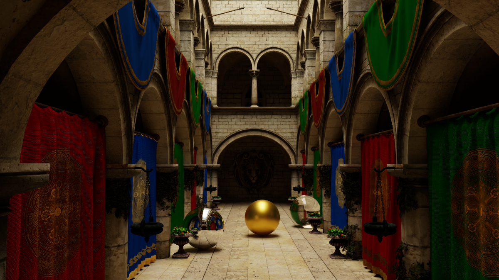
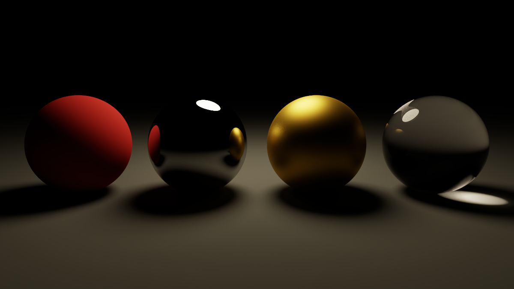
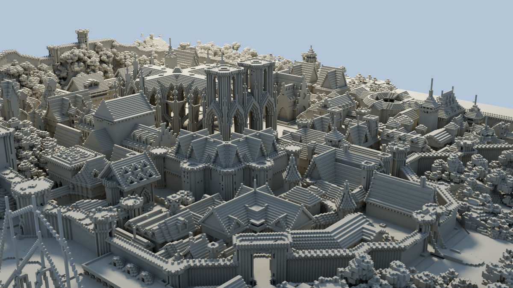

# tinypt

Rust 製のモンテカルロパストレーサー。

## ギャラリー

<table>
<tr>
<td width="34%"><a href="docs/images/showcase_sponza_textured.png"></a><br>Crytek Sponza (262,267 三角形、テクスチャ + アルファマスク + バンプマップ)。512spp、1200x675、デノイズあり。<a href="sample/sponza_textured.xml"><code>sample/sponza_textured.xml</code></a></td>
<td width="33%"><a href="docs/images/showcase_default.png"></a><br>組み込みマテリアルサンプル (拡散・金属・GGX・ガラス)。2048spp、1200x675、デノイズあり。<a href="sample/default.xml"><code>sample/default.xml</code></a></td>
<td width="33%"><a href="docs/images/showcase_rungholt.png"></a><br>Rungholt (6,704,264 三角形)。512spp、1200x675、デノイズあり。<a href="sample/rungholt.xml"><code>sample/rungholt.xml</code></a></td>
</tr>
</table>

Sponza と Rungholt は外部モデル ([取得方法](#外部ベンチマークモデル-sponza--rungholt))。
出典: Morgan McGuire, *Computer Graphics Archive*, July 2017 (<https://casual-effects.com/data>)。
Sponza Atrium は CC BY 3.0 / © 2010 Frank Meinl, Crytek。Rungholt は CC BY 3.0 / © kescha。

## 特徴

- **BVH 加速構造** (SAH) による高速レイ-ジオメトリ交差判定
- **スムーズシェーディング**: OBJ の頂点法線を補間 ([詳細](#スムーズシェーディング-法線の補間))
- **テクスチャ**: ビットマップテクスチャ (UV バイリニア、sRGB デコード) ([詳細](#テクスチャ))
- **マテリアル**: ランバート拡散・完全鏡面金属・GGX マイクロファセット・誘電体 (ガラス)・面光源 ([詳細](#マテリアル))
- **Multiple Importance Sampling (MIS)** + **Next Event Estimation (NEE)** による分散低減
- **Firefly クランプ**: 寄与単位・輝度ベース (閾値 50)。発光体/背景ヒットと NEE のすべての寄与に適用し、MIS の両側で同じ上限になる (バイアスあり)
- **アダプティブサンプリング**: 収束判定による効率的なサンプル配分 (停止規則によるバイアスあり、[詳細](#アダプティブサンプリングのバイアス))
- **Intel OIDN** を使った AI デノイズ (デフォルト有効)
- **タイル並列レンダリング** (Morton オーダー対応)
- **チェックポイント**: レンダリング途中状態の保存・再開 ([詳細](#チェックポイント))
- **出力フォーマット**: PPM (バイナリ P6、トーンマップ後 8bit sRGB) / HDR (RGBE、リニア sRGB) / EXR (float32、リニア ACEScg)
- **シーンファイル**: Mitsuba XML サブセットの読み込み (`--scene`) ([詳細](#シーンファイル-mitsuba-xml))

### スムーズシェーディング (法線の補間)

OBJ の頂点法線 (`vn`) を重心座標で補間し、BSDF の評価と NEE の cos 項に使う。分割の粗いメッシュでも陰影が滑らかになる。

**幾何法線とシェーディング法線は別物として扱う**。自己交差回避のレイ原点ずらし・表裏の判定・光源の面積と pdf には常に**幾何法線** (面法線) を使い、BSDF と NEE の cos 項だけが**シェーディング法線** (補間法線) を見る。混同すると、スケール非依存の自己交差回避 (`offset_ray_origin`) が壊れる。

補間法線のせいで散乱方向や NEE 方向が幾何的に面の裏側へ回る場合、その寄与は 0 にする (エネルギーを増やさない)。捨てるぶんは失われるが、出方はマテリアルによって違う:

- **拡散面**: 損失は小さくメッシュ全体にほぼ一様に散る。粗い球 (144 三角形、隣接頂点法線の開き 30°) の白炉テストで全体 0.9%、輪郭に集中しないので暗い縁は見えない。
- **透過 (誘電体)**: 損失が大きく輪郭付近に集中する。同じ球で棄却率は拡散の 1.0% に対し 2.8%、粗いガラス球では輪郭の内側に薄い暗部が見える。
- GGX の棄却率 (粗さ 0.4 で約 15%) の大半はスムーズシェーディング以前からあるもの (VNDF が地平線下の反射方向を出す既知の性質で約 12.5%)。補間が足すぶんは数ポイント。

頂点法線を持たないシーン (`rectangle` / `cube` / `disk` / `sphere`、`vn` の無い OBJ) の出力は**ビット単位で以前と同じ**。

### テクスチャ

OBJ の `vt` を重心座標で補間し (`Hit.uv`)、`diffuse` の `reflectance` にビットマップテクスチャを指定できる。

```xml
<bsdf type="diffuse">
  <texture type="bitmap" name="reflectance">
    <string name="filename" value="textures/brick.png"/>
    <string name="wrap_mode" value="repeat"/>  <!-- repeat (既定) / clamp -->
  </texture>
</bsdf>
```

- **色空間**: 色テクスチャは **sRGB** としてデコードする (PPM 出力のエンコードの正確な逆)。`<boolean name="raw" value="true"/>` を付けるとリニアのまま読む (データテクスチャ用)。
- **フィルタ**: バイリニア (テクセル中心基準)。ミップマップは未対応。
- **UV の向き**: OBJ/Mitsuba の `vt` は左下が原点 (v が上向き)。画像は上の行から並ぶので、テクセル行は `(1 − v)` 側から数える。
- **定数色との併用**: `<rgb name="reflectance">` も書くと、その色は**倍率**としてテクスチャに掛かる。片方だけなら他方は白 (1 倍)。
- **パラメトリック形状の UV**: Mitsuba 準拠。`rectangle` = `((x+1)/2, (y+1)/2)`、`cube` = 面ごとに `[0,1]²`、`disk` = `(r, φ/2π)`、`sphere` = `(φ/2π, θ/π)` (極は ±z)。
- **現状の制限**: XML でテクスチャを指定できるのは `diffuse` の `reflectance` のみ。ミップマップは未対応。
- **OBJ の `usemtl` / MTL**: OBJ の `<shape>` に `<bsdf>` も `<emitter>` も書かないと、`mtllib` の MTL から材質を作る (1 メッシュのまま、`usemtl` ごとに三角形の材質が変わる。BVH は割らない)。`<bsdf>` があれば従来どおり**全体を上書き**し MTL は読まない (`sample/sponza.xml` はこちら)。`<boolean name="use_mtl" value="false"/>` でも MTL を無視できる。例: `sample/sponza_textured.xml`。
  - MTL → BSDF: **`map_Kd` があれば常に** `Lambert { albedo: Kd, albedo_tex }` (sRGB デコード。`Kd` は倍率として掛かる)。`map_Kd` が無く、`Ks` の輝度 > 0.05 かつ `Ns` > 1 なら `Ggx { albedo: Ks, alpha = sqrt(2/(Ns+2)) }` (alpha は [1e-3, 1])。どちらでもなければ `Lambert { albedo: Kd }`。`usemtl` 前の面と MTL に無い名前は灰色の拡散。
    (`map_Kd` を優先するのは、拡散テクスチャと明るい鏡面反射を両方持つ材質を先に GGX 化すると拡散テクスチャがまるごと捨てられてしまうため — 拡散 + 光沢の合成 BSDF は `Material` に新しい variant が要るので扱わない。)
  - `map_d` はアルファマスク、`map_bump` / `norm` は法線の摂動 ([詳細](#法線マップ--バンプマップ))。未対応: 定数の `d < 1` (シーンで 1 回だけ警告)、`map_Ka` / 非ゼロの `Ke` (材質ごとに 1 回警告)。
  - MTL の癖に対応: タブ字下げ、テクスチャパスの `\` (→ `/`)、未知キー、`newmtl` の重複 (最初の定義を残す)。テクスチャは解決済み絶対パスでキャッシュし、同じ画像を 2 度読まない。
- 読み込みに失敗したテクスチャは警告して定数色にフォールバックする (描画は続く)。

## マテリアル

各マテリアルは BSDF として `sample`（散乱方向・スループット重み・PDF）と `eval`（NEE 用の値・PDF）を提供する。

| 種類 | パラメータ | 概要 |
|---|---|---|
| `Lambert` | `albedo` | 完全拡散反射。コサイン重み付き半球サンプリング |
| `Metal` | `albedo` | 完全鏡面反射（デルタ BSDF） |
| `Dielectric` | `ior`, `absorption` | 屈折体。フレネル + Beer-Lambert 吸収（デルタ BSDF） |
| `Ggx` | `albedo`, `alpha` | GGX マイクロファセット反射（下記参照） |
| `Subsurface` | `albedo` | 簡易サブサーフェス（現状は Lambert と同一の拡散反射）。シーンファイル・組み込みシーンからは指定不可 |
| `DiffuseLight` | `emit` | 拡散面光源 |

### 法線マップ / バンプマップ

Mitsuba 準拠のラッパー `bsdf` で、内側の `<bsdf>` に法線の摂動を掛ける (シェーディング法線だけを変える。幾何法線・影・光源には影響しない)。

```xml
<bsdf type="normalmap">   <!-- タンジェント空間ノーマルマップ (リニア固定で読む) -->
  <texture type="bitmap" name="normalmap"><string name="filename" value="n.png"/></texture>
  <bsdf type="diffuse"/>
</bsdf>
<bsdf type="bumpmap">     <!-- ハイトマップ (輝度)。scale は 1 テクセルあたりの傾きの倍率 (既定 1) -->
  <float name="scale" value="8"/>
  <texture type="bitmap" name="bumpmap"><string name="filename" value="h.png"/></texture>
  <bsdf type="diffuse"/>
</bsdf>
```

`twosided` の内側にも置ける。UV を持つメッシュ (OBJ・`rectangle`・`cube`・`disk`) にだけ効く (球や UV 無しは摂動しない)。バンプの強さは無次元で、モデルを一様に拡大縮小しても見た目が変わらない。Sponza の煉瓦のハイトマップでは `scale` 4〜16 で明瞭な凹凸になる。OBJ の MTL では `map_bump` (`-bm` 強度、既定 1) がハイトマップ、`norm` (拡張) がタンジェント空間ノーマルマップとして自動で効く (両方あれば `norm`)。強度は `-bm × 8` (Sponza で選んだ換算係数 `MTL_BUMP_K`)。

### GGX マイクロファセット

物理ベースの光沢反射マテリアル。`Metal` の完全鏡面と異なり、表面の微細な凹凸（マイクロファセット）による粗さを表現する。

- **法線分布関数 (NDF)**: Trowbridge-Reitz (GGX) — `D(θ_h) = α² / (π (cos²θ_h (α²−1) + 1)²)`
- **遮蔽・シャドウイング**: Smith の分離可能 G 項（`G = G₁(ω_i)·G₁(ω_o)`）
- **フレネル**: Schlick 近似（`albedo` を F₀ 反射率として使用）
- **サンプリング**: 可視法線分布 (VNDF) サンプリング（Heitz, JCGT 2018）。グレイジング角での無効サンプルを大幅に削減
- **重要度サンプリングの一貫性**: `sample` が返すスループット重み `f·cos/pdf` と MIS に使う PDF は同一の VNDF PDF に基づく

#### パラメータ

| パラメータ | 型 | 説明 |
|---|---|---|
| `albedo` | `Color` | 鏡面反射率（フレネル F₀）。金属の色味を決める |
| `alpha` | `f64` | 粗さ。`0` に近いほど鏡面、大きいほど拡散的な光沢。内部で `max(1e-3)` にクランプ |

`alpha = 0.25` 程度で、デフォルトシーンのゴールド球のような柔らかいハイライトを持つ光沢金属になる。

## ビルド

```bash
cargo build --release
```

デノイズなしでビルドする場合:

```bash
cargo build --release --no-default-features
```

この場合もデノイズはデフォルト有効のままなので、実行ごとに OIDN 未対応の警告 (2 行) が出てデノイズはスキップされる。`--no-denoise` を付けると警告は出ない。

## 使い方

```bash
./target/release/tinypt [オプション]
# または
cargo run --release -- [オプション]
```

以下の例はリポジトリのルートで実行する前提。

未知のオプション、数値として解釈できない値 (`--exposure` / `--adaptive-threshold` の NaN・無限大を含む)、値の欠落は stderr に `Warning:` を出して無視する (終了コードは変わらない)。`--spp 0` / `--adaptive-min-spp 0` は警告して 1 にする。`-h` / `--help` で使い方を表示して終了する (レンダーしない)。

組み込みシーンの解像度は常に 1920x1080 (CLI から変更不可)。解像度を変えるにはシーンファイルの `<film>` を使う。

### 主なオプション

| オプション | デフォルト | 説明 |
|---|---|---|
| `--scene PATH` | — | Mitsuba XML シーンファイル (未指定で組み込みシーン) |
| `--spp N` | 512 | サンプル数 (samples per pixel) |
| `-o, --out PATH` | `out.ppm` | 出力ファイル (拡張子で形式を自動判定) |
| `--env PATH` | — | HDR/EXR 環境マップ。**組み込みシーンのみ有効** (`--scene` 時は無視され XML の `<emitter>` が使われる)。読み込み失敗時は警告して空のグラデーションにフォールバック |
| `--no-env` | — | それ以前に指定した `--env` を取り消す (デフォルトも未指定＝手続き的な空) |
| `--denoise` / `--no-denoise` | 有効 | Intel OIDN デノイズ |
| `--adaptive` / `--no-adaptive` | 無効 | アダプティブサンプリング (バイアスあり、[下記](#アダプティブサンプリングのバイアス)) |
| `--adaptive-min-spp N` | 8 | アダプティブサンプリングの最小サンプル数 (0 は警告して 1 にする) |
| `--adaptive-threshold N` | 0.02 | 収束閾値 (相対標準偏差、負値は 0 に丸め) |
| `--seed N` | 0 | 乱数シード。同じ設定なら出力はスレッド数に依らず決定論的 |
| `--tonemap none\|aces` | `aces` | トーンマッピング (**PPM 出力のみ**。HDR/EXR はシーン参照リニア値をそのまま保存) |
| `--exposure N` | 0.0 | 露出補正 (EV 単位、**PPM 出力のみ**) |
| `--morton` / `--no-morton` | 有効 | タイルを Morton (Z) オーダーで処理 |
| `--checkpoint` / `--no-checkpoint` | 無効 | チェックポイント保存・再開 (`checkpoint_<hash>.bin`、完了時に削除) |
| `--checkpoint-every N` | 128 | N タイルごとに保存 (指定でチェックポイントも有効化。0 は無効値として警告し間隔は変えない) |

### 出力形式

| 拡張子 | 形式 | 画素値 | ファイルサイズ (1920x1080) |
|---|---|---|---|
| `.ppm` (その他の拡張子も) | バイナリ PPM (P6、maxval 255) | 露出・トーンマップ後の sRGB 8bit | ヘッダ + 画素数 × 3 バイト (約 5.9 MB) |
| `.hdr` | Radiance HDR (RGBE、行ごとの RLE) | リニア sRGB | 画像内容による (最大で画素数 × 4 バイト強、約 8 MB。組み込みシーン 1 spp で 4.7 MB) |
| `.exr` | OpenEXR (float32、`exr` crate の FAST_LOSSLESS 圧縮) | リニア ACEScg | 画像内容による (非圧縮で約 25 MB。組み込みシーン 1 spp で 25 MB) |

PPM は以前の ASCII 形式 (P3。組み込みシーン 1 spp の 1920x1080 で 23.9 MB) からバイナリ形式 (P6、6,220,817 バイト = 17 バイトのヘッダ + 1920 × 1080 × 3) に変わった。画素値は同じで、P3 のファイルを期待するツールで読む場合は変換が必要。

**再現性はファイル単位ではなく画素単位**: 同じ設定なら画素値はスレッド数に依らず再現するが (`--seed`)、
`.exr` だけは**同じ画素値でもファイルがバイト単位で一致しない** (圧縮ブロックの都合。同一シーン・同一 seed で
2 回描くと、サイズは同じまま数十万バイト分が異なる)。`.ppm` と `.hdr` は 2 回描いてもバイト単位で一致する。
回帰比較にハッシュを使うなら `.ppm` か `.hdr` を使うか、`.exr` はデコードして画素値で比べること。

### アダプティブサンプリングのバイアス

`--adaptive` は、各画素で `--adaptive-min-spp` 以上のサンプルを取った後、サンプルの輝度の相対標準偏差 (標本標準偏差 / max(|平均|, 1e-4)。ほぼ黒い画素はすぐ打ち切られる) が `--adaptive-threshold` を下回った時点でその画素のサンプリングを打ち切り、それまでのサンプルの平均を出力する。**打ち切るかどうかを、平均を取るのと同じサンプルで決めるため、この推定は不偏ではない** (停止規則によるバイアス)。

- 例えば、まれに明るいサンプル (コースティクス・小さな光源・firefly) が来る画素では、明るいサンプルがまだ来ていない「ばらつきが小さく見える」時点で打ち切られやすく、暗めに偏る。光源の縁のように明るいサンプルが続いた時点で打ち切られる画素は、明るめに偏る。
- サンプル数を増やしても、このバイアスは消えない (打ち切りの判定は `--spp` と無関係に min spp の時点から始まる)。
- バイアスの大きさと向きはシーンに依存する。目安として、画像全体の平均輝度を非アダプティブと比べると (min spp 8。非アダプティブのシード間ばらつきは約 0.02%):
  - `sample/cornell.xml` (600x600、64 spp): 閾値 0.02 (デフォルト) で +0.09%、0.3 で −0.5%、1.0 で −1.9%
  - `sample/default.xml` (480x270、64 spp): 閾値 0.02 で −1.0%、0.3 で −1.8%、1.0 で −1.8%
- 正確な値が必要な場合 (参照画像・比較・検証) は `--no-adaptive` (デフォルト) を使う。

### チェックポイント

- ファイルは**カレントディレクトリ**に `checkpoint_<hash>.bin` として書かれ、レンダリング完了時に削除される。
- `<hash>` はシーン内容 (XML 本体と参照する OBJ / 環境マップの内容、組み込みシーンでは `--env` の内容)、解像度、spp、`max_depth`・`rr_depth`、seed、アダプティブ設定 (有効/min spp/閾値)、タイルサイズ、Morton 順序、レンダラーのバージョン (`Cargo.toml` の version と出力挙動のリビジョン定数 `RENDER_REVISION`) から導出する。これらを変えると古いチェックポイントは使われず最初からレンダーする。`--tonemap` / `--exposure` / `-o` / デノイズ設定は変えても再開できる。
- 保存は一時ファイル (`.tmp`) に書いてからリネームする。保存中に強制終了して残った同名の `.tmp` は、次回チェックポイント有効で起動したときに削除される。
- ファイル末尾にチェックサム (FNV-1a 64bit) を持ち、一致しない・フォーマットのバージョンが違う (旧形式を含む) 場合は読み込まずに最初からレンダーする。
- 保存 1 回あたり画素数 × 32 バイトを書き込む (1920x1080 で約 66 MB)。

### 出力例

```bash
# PPM に 1024 spp でレンダリング
./target/release/tinypt --spp 1024 -o output.ppm

# EXR 出力 + 環境マップ使用 (組み込みシーン)
./target/release/tinypt --spp 2048 -o output.exr --env sample/env.exr

# デノイズなし + アダプティブサンプリング
./target/release/tinypt --no-denoise --adaptive --spp 4096 -o output.hdr

# Mitsuba XML シーンを読み込んでレンダリング
./target/release/tinypt --scene sample/default.xml -o output.ppm
```

## シーンファイル (Mitsuba XML)

`--scene` で [Mitsuba レンダラー](https://www.mitsuba-renderer.org/) の XML シーン記述のサブセットを読み込める（未指定時は組み込みのデフォルトシーン）。採用理由は [`docs/adr/0002`](docs/adr/0002-mitsuba-xml-scene-format.md) を参照。

```bash
./target/release/tinypt --scene sample/default.xml -o output.ppm
```

### 対応要素

| 要素 | 対応内容 |
|---|---|
| `<sensor type="perspective">` | `fov` / `fov_axis` / `to_world`(`lookat`) / `aperture_radius` / `focus_distance` (DOF、焦点は視線に垂直な平面) |
| `<shape type="sphere">` | `center` / `radius` |
| `<shape type="obj">` | `filename` (XML からの相対パス) + `to_world` + `face_normals` (下記) |
| `<shape type="rectangle"\|"cube"\|"disk">` | Mitsuba 正準形メッシュ + `to_world` |
| `<transform>` | `translate` / `rotate` (任意軸) / `scale` (均一・非均一) / `matrix` (4×4) |
| `<texture type="bitmap">` | `diffuse` の `reflectance` に指定 (`filename` / `wrap_mode` / `raw`) ([詳細](#テクスチャ)) |
| `<bsdf>` | `diffuse` / `conductor` / `roughconductor`(ggx) / `dielectric`・`thindielectric`・`roughdielectric` (いずれも `Dielectric`、独自拡張の `absorption` 対応) / `twosided`。未知の型は警告して `diffuse` にフォールバック |
| `<emitter type="area">` | `radiance` (shape に付随する面光源) |
| `<emitter type="envmap"\|"constant">` | 環境マップ (`filename` / `radiance`、`scale` 対応。等距離円筒図法、テクセル中心基準の双線形補間) |
| `<film>` / `<sampler>` / `<integrator>` | 解像度 / `sample_count` / `max_depth`・`rr_depth` (Mitsuba と同じパス長の意味: `max_depth` 1 = 直接見える発光体のみ、2 = 直接照明まで、-1 = 無制限。組み込みシーンの既定は `max_depth` 9・`rr_depth` 4) |

- **色**: `<rgb>` はリニア、`<srgb>` は sRGB (ガンマ展開)。
- **CLI 優先**: `--spp` はシーンファイルの `sample_count` を上書きする (解像度・`max_depth`・`rr_depth` は CLI から変更不可)。
- **背景**: 環境 emitter が無ければ黒 (Mitsuba 準拠)。組み込みシーンの手続き的な空は使わない。
- **スムーズシェーディング**: OBJ に頂点法線 (`vn`) があれば重心座標で補間してシェーディングに使う (既定)。`<boolean name="face_normals" value="true"/>` を shape に書くと頂点法線を捨てて面法線だけで陰影を付ける。`rectangle` / `cube` / `disk` / `sphere` は元から頂点法線を持たないので、この指定で結果は変わらない。 値は Mitsuba と同じく `true` / `false` のみで、それ以外 (`1` / `yes` / `TRUE` など) は**警告して既定にフォールバック**する。
- 未対応の要素・型・属性は警告してスキップ／フォールバックする (寛容なパース)。ただし `<default>` と `<rfilter>` は**警告なし**で無視される。
- スペクトルや `<default>`/`$param` 置換、環境マップの `to_world` 回転は未対応。`$param` に依存するシーンでも警告は出ない。

### サンプル

| ファイル | 内容 |
|---|---|
| `sample/default.xml` | 組み込みデフォルトシーン相当 (地面 + 球4個 + 球光源、背景は黒) |
| `sample/mesh.xml` | OBJ メッシュ (立方体) + transform/instance |
| `sample/env_scene.xml` | 環境マップ (`env.exr`) によるライティング |
| `sample/cornell.xml` | Cornell box (rectangle/cube + 面光源)。`--tonemap none` 推奨 |
| `sample/highpoly.xml` | 高ポリゴン検証シーン (約 100 万三角形)。**OBJ の生成が必要** ([下記](#高ポリゴン検証シーン)) |
| `sample/sponza.xml` | Crytek Sponza (262,267 三角形)。**モデルの取得が必要** ([下記](#外部ベンチマークモデル-sponza--rungholt)) |
| `sample/rungholt.xml` | Rungholt (6,704,264 三角形)。**モデルの取得が必要** ([下記](#外部ベンチマークモデル-sponza--rungholt)) |


#### 高ポリゴン検証シーン

`sample/highpoly.xml` は、読み込み・BVH 構築・描画の性能を確かめるための高ポリゴンシーン
(変位地形 + トーラス結び目のチューブ + 中規模メッシュ 36 インスタンス + 面光源 + 弱い環境光)。
OBJ は 100 万三角形で 30MB を超えるためリポジトリには入っていない。**先に生成すること**:

```bash
python3 tools/gen_highpoly.py                   # 既定: シーン全体で約 100 万三角形
python3 tools/gen_highpoly.py --tris 5000000    # 三角形数を変える (100 万 → 500 万)
./target/release/tinypt --scene sample/highpoly.xml --spp 128 -o renders/highpoly.ppm
```

生成先は `assets/highpoly/` (`.gitignore` の `*.obj` で無視される。`sample/` は
`!sample/**` で無視が打ち消されるので、そこには置かないこと)。`--tris` を変えても
シーン XML は変更不要 — OBJ のファイル名とインスタンス配置は固定で、分割数だけが変わる。
OBJ が無いまま実行すると shape ごとに `failed to load obj ...; skipped` と警告が出て、
そのメッシュ抜きで描画が続く。全 OBJ が欠けると、ジオメトリの無い環境光だけの一様な青灰色のフレーム (画素平均 87/255) になり、真っ黒にはならないので、警告を見落とさないこと。


#### 外部ベンチマークモデル (Sponza / Rungholt)

広く使われている 2 つの公開モデルを取り込める。**モデルデータはリポジトリに入っていない**ので、
取得スクリプトを先に実行すること (zip 合計 128MB、展開して 361MB。`assets/` は `.gitignore` 済み)。

```bash
tools/fetch_models.sh                # 両方 (既に展開済みならスキップ)
tools/fetch_models.sh sponza         # 片方だけ
./target/release/tinypt --scene sample/sponza.xml   --spp 256 -o renders/sponza.ppm
./target/release/tinypt --scene sample/rungholt.xml --spp 512 -o renders/rungholt.ppm
```

| シーン | 三角形 | 内容 |
|---|---:|---|
| `sample/sponza.xml` | 262,267 | Crytek Sponza のアトリウム内部。モデルは cm 単位なので `to_world` で 0.01 倍している。`<bsdf>` で全体を 1 つの diffuse にし (MTL は使わない)、BSDF の違いは床置きの球 3 個 (conductor / roughconductor / dielectric) で見る |
| `sample/sponza_textured.xml` | 262,267 | 上と同じ構図で、`sponza.mtl` とテクスチャ (`assets/models/sponza/textures/`) を使う本来の見た目版 |
| `sample/rungholt.xml` | 6,704,264 | Minecraft の街 "Neu Rungholt" を俯瞰。単位は m でスケール変換不要。全体を 1 つの diffuse に割り当て |

どちらも「高所の面光源 (太陽相当) + `constant` の空」で照らしていて、面光源 NEE と環境 NEE の両方が効く。
モデルが無いまま実行すると `failed to load obj ...; skipped` と警告が出た上で、終了コード 0 のままモデル抜きで
描画が進む (Sponza は空に球 3 個だけ、Rungholt は空一色の画像になる)。その場合は `tools/fetch_models.sh` を実行すること。

**出典・ライセンス**: Morgan McGuire, *Computer Graphics Archive*, July 2017
(<https://casual-effects.com/data>)。
Sponza Atrium は CC BY 3.0 / © 2010 Frank Meinl, Crytek (原型は 2002 年 Marko Dabrovic 作)、
Rungholt は CC BY 3.0 / © kescha ("Neu Rungholt" を Mineways で OBJ 化)。
再配布しないこと (スクリプトが配布元から直接取得する)。

```bash
./target/release/tinypt --scene sample/mesh.xml -o mesh.ppm
./target/release/tinypt --scene sample/env_scene.xml -o env.ppm
./target/release/tinypt --scene sample/cornell.xml --tonemap none -o cornell.ppm
```

### 記述例

```xml
<scene version="3.0.0">
  <sensor type="perspective">
    <float name="fov" value="40"/>
    <string name="fov_axis" value="y"/>
    <transform name="to_world">
      <lookat origin="0, 1.2, 4" target="0, 0.5, 0" up="0, 1, 0"/>
    </transform>
  </sensor>

  <shape type="sphere">
    <point name="center" x="0" y="0.5" z="0"/>
    <float name="radius" value="0.5"/>
    <bsdf type="roughconductor">
      <string name="distribution" value="ggx"/>
      <float name="alpha" value="0.25"/>
      <srgb name="specular_reflectance" value="0.95, 0.78, 0.35"/>
    </bsdf>
  </shape>

  <emitter type="constant"><rgb name="radiance" value="1, 1, 1"/></emitter>
</scene>
```

## プロファイリング

```bash
RUSTFLAGS="-C force-frame-pointers=yes" cargo build --profile profiling
```

macOS では Instruments の Time Profiler で `target/profiling/tinypt` を指定してサンプリング。
