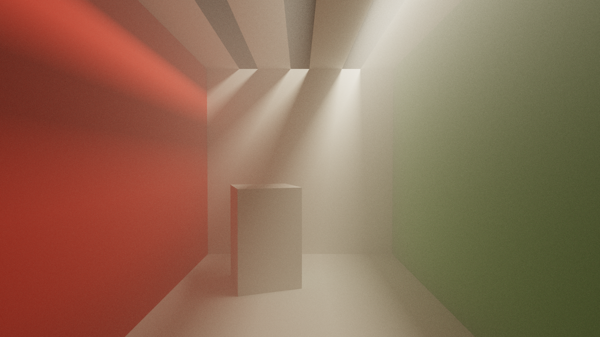
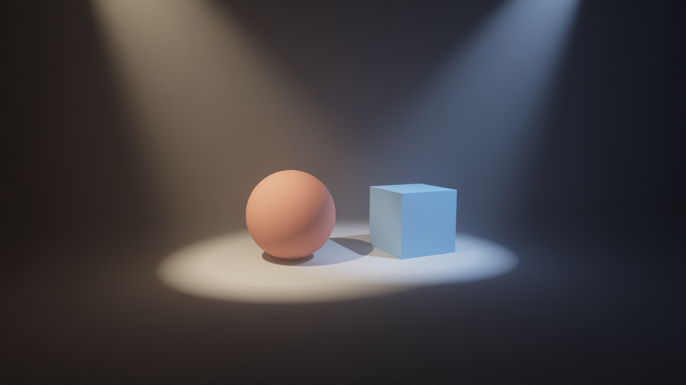
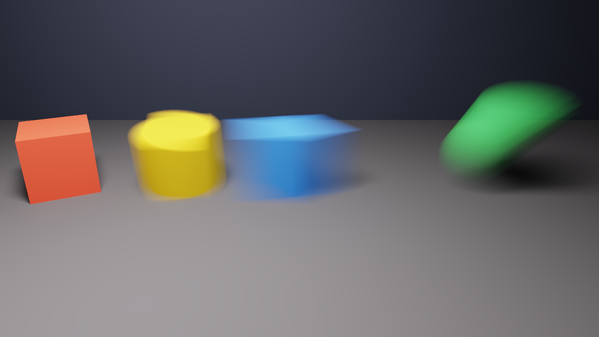

# tinypt

Rust 製のモンテカルロパストレーサー。

## ギャラリー

<table>
<tr>
<td width="34%"><a href="docs/images/showcase_sponza_textured.png"></a><br>Crytek Sponza (262,267 三角形、テクスチャ + アルファマスク + バンプマップ)。512spp、1200x675、デノイズあり。<a href="sample/sponza_textured.xml"><code>sample/sponza_textured.xml</code></a></td>
<td width="33%"><a href="docs/images/showcase_default.png"></a><br>組み込みマテリアルサンプル (拡散・金属・GGX・ガラス)。2048spp、1200x675、デノイズあり。<a href="sample/default.xml"><code>sample/default.xml</code></a></td>
<td width="33%"><a href="docs/images/showcase_rungholt.png"></a><br>Rungholt (6,704,264 三角形)。512spp、1200x675、デノイズあり。<a href="sample/rungholt.xml"><code>sample/rungholt.xml</code></a></td>
</tr>
<tr>
<td width="34%"><a href="docs/images/showcase_fog.png"></a><br>参加媒質 (霧) と天井のスリットからのゴッドレイ。2048spp、1200x675、デノイズあり。<a href="sample/fog.xml"><code>sample/fog.xml</code></a></td>
<td width="33%"><a href="docs/images/showcase_spotlight.png"></a><br>スポットライト 2 灯と薄い霧 (デルタ光源)。2048spp、1200x675、デノイズあり。<a href="sample/spotlight.xml"><code>sample/spotlight.xml</code></a></td>
<td width="33%"><a href="docs/images/showcase_motion.png"></a><br>モーションブラー (静止・回転・移動 + 回転・頂点変形)。2048spp、1200x675、デノイズあり。<a href="sample/motion.xml"><code>sample/motion.xml</code></a></td>
</tr>
</table>

Sponza と Rungholt は外部モデル ([取得方法](#外部ベンチマークモデル-sponza--rungholt))。
出典: Morgan McGuire, *Computer Graphics Archive*, July 2017 (<https://casual-effects.com/data>)。
Sponza Atrium は CC BY 3.0 / © 2010 Frank Meinl, Crytek。Rungholt は CC BY 3.0 / © kescha。

## 特徴

- **BVH 加速構造** (SAH) による二層構成。メッシュごとの BVH (物体空間) の上に、インスタンスと球をまとめて覆うトップレベル BVH (TLAS) を載せる。構築は部分木ごとに並列化 (逐次構築とビット単位で同じ木を作る) ([詳細](#メッシュの共有と-tlas))
- **メッシュの共有**: 同じ OBJ を何度配置しても三角形と BVH は 1 つ。材質はインスタンスごとに変えられる
- **スムーズシェーディング**: OBJ の頂点法線を補間 ([詳細](#スムーズシェーディング-法線の補間))
- **テクスチャ**: ビットマップテクスチャ (UV バイリニア、sRGB デコード) ([詳細](#テクスチャ))
- **マテリアル**: ランバート拡散・完全鏡面金属・GGX マイクロファセット・誘電体 (ガラス)・面光源 ([詳細](#マテリアル))
- **参加媒質**: 一様な霧・煙 (σt・アルベド・Henyey-Greenstein の g・任意の AABB 範囲)。チャンネル MIS 付きの距離サンプリング、媒質散乱点での NEE ([詳細](#参加媒質))
- **デルタ光源**: 点・平行・スポットライト。NEE で全灯を評価し MIS なし・乱数なし ([詳細](#デルタ光源))
- **モーションブラー**: 回転・スケール・せん断を含む一般のアフィン変換の動き (`to_world_end`) と、OBJ 2 枚による頂点モーション (`filename_end`)、シャッター時刻 ([詳細](#モーションブラー))
- **Multiple Importance Sampling (MIS)** + **Next Event Estimation (NEE)** による分散低減
- **Owen スクランブル付き Sobol 列のサンプラー**: ピクセル内のジッター・レンズ・時刻・各バウンス (深さ 8 まで) の BSDF 方向・NEE・Russian roulette・媒質の距離を、役割ごとに固定した次元で層化する (それ以降は PCG)。従来の √spp × √spp の層化 (ジッターと最初のバウンスの面光源 NEE だけ) に対し、同じ spp で分散が cornell −31%・default −40%・spiral −20%・sponza −12% (平均は変わらない)。次元の割り当ては `src/sampler.rs` の表
- **Firefly クランプ**: 寄与単位・輝度ベース (閾値 50)。発光体/背景ヒットと NEE のすべての寄与に適用し、MIS の両側で同じ上限になる (バイアスあり)
- **アダプティブサンプリング**: 収束判定による効率的なサンプル配分 (停止規則によるバイアスあり、[詳細](#アダプティブサンプリングのバイアス))
- **Intel OIDN** を使った AI デノイズ (デフォルト有効)
- **タイル並列レンダリング** (Morton オーダー対応)
- **チェックポイント**: レンダリング途中状態の保存・再開 ([詳細](#チェックポイント))
- **出力フォーマット**: PPM (バイナリ P6、トーンマップ後 8bit sRGB) / HDR (RGBE、リニア sRGB) / EXR (float32、リニア ACEScg)
- **シーンファイル**: Mitsuba XML サブセットの読み込み (`--scene`) ([詳細](#シーンファイル-mitsuba-xml))

### スムーズシェーディング (法線の補間)

OBJ の頂点法線 (`vn`) を重心座標で補間し、BSDF の評価と NEE の cos 項に使う。分割の粗いメッシュでも陰影が滑らかになる。

**幾何法線とシェーディング法線は別物として扱う**。自己交差回避のレイ原点ずらし・表裏の判定・光源の面積と pdf には常に**幾何法線** (面法線) を使い、BSDF と NEE の cos 項だけが**シェーディング法線** (補間法線) を見る。混同すると、スケール非依存の自己交差回避 (`offset_ray_origin`) が壊れる。

補間法線のせいで散乱方向や NEE 方向が幾何的に面の裏側へ回る場合、その寄与は 0 にする (エネルギーを増やさない)。捨てるぶんは失われるが、出方はマテリアルによって違う:

- **拡散面**: 損失は小さくメッシュ全体にほぼ一様に散る。粗い球 (144 三角形、隣接頂点法線の開き 30°) の白炉テストで全体 0.9%、輪郭に集中しないので暗い縁は見えない。
- **透過 (誘電体)**: 損失が大きく輪郭付近に集中する。同じ球で棄却率は拡散の 1.0% に対し 2.8%、粗いガラス球では輪郭の内側に薄い暗部が見える。
- GGX の棄却率 (粗さ 0.4 で約 15%) の大半はスムーズシェーディング以前からあるもの (VNDF が地平線下の反射方向を出す既知の性質で約 12.5%)。補間が足すぶんは数ポイント。

頂点法線を持たないシーン (`rectangle` / `cube` / `disk` / `sphere`、`vn` の無い OBJ) の出力は**ビット単位で以前と同じ**。

### テクスチャ

OBJ の `vt` を重心座標で補間し (`Hit.uv`)、`diffuse` の `reflectance` にビットマップテクスチャを指定できる。

```xml
<bsdf type="diffuse">
  <texture type="bitmap" name="reflectance">
    <string name="filename" value="textures/brick.png"/>
    <string name="wrap_mode" value="repeat"/>  <!-- repeat (既定) / clamp -->
  </texture>
</bsdf>
```

- **色空間**: 色テクスチャは **sRGB** としてデコードする (PPM 出力のエンコードの正確な逆)。`<boolean name="raw" value="true"/>` を付けるとリニアのまま読む (データテクスチャ用)。
- **フィルタ**: バイリニア (テクセル中心基準)。ミップマップは未対応。
- **UV の向き**: OBJ/Mitsuba の `vt` は左下が原点 (v が上向き)。画像は上の行から並ぶので、テクセル行は `(1 − v)` 側から数える。
- **定数色との併用**: `<rgb name="reflectance">` も書くと、その色は**倍率**としてテクスチャに掛かる。片方だけなら他方は白 (1 倍)。
- **パラメトリック形状の UV**: Mitsuba 準拠。`rectangle` = `((x+1)/2, (y+1)/2)`、`cube` = 面ごとに `[0,1]²`、`disk` = `(r, φ/2π)`、`sphere` = `(φ/2π, θ/π)` (極は ±z)。
- **現状の制限**: XML でテクスチャを指定できるのは `diffuse` の `reflectance` のみ。
- **手続き的な 3D ノイズ** (`<texture type="noise">`、**tinypt の独自拡張**): `diffuse` の `reflectance` に、画像の代わりに置ける。交差点の**3D 座標**で評価するソリッドノイズ (Perlin) なので、球の極や UV の継ぎ目で歪まない。画像テクスチャと同じく、定数色の `reflectance` を併記すると倍率になる。

```xml
<texture type="noise" name="reflectance">
  <string name="pattern" value="marble"/>   <!-- fbm (既定) / turbulence / marble / wood / granite -->
  <float name="scale" value="4.0"/>          <!-- 空間周波数。既定 1、(0, 1e6] -->
  <integer name="octaves" value="5"/>        <!-- 既定 4、1..10 -->
  <float name="lacunarity" value="2.0"/>     <!-- 既定 2、1..8 -->
  <float name="gain" value="0.5"/>           <!-- 既定 0.5、0..1 -->
  <float name="strength" value="6.0"/>       <!-- marble / wood の歪み。既定 1 -->
  <rgb name="color0" value="0.05, 0.05, 0.06"/>   <!-- t=0 の色。既定 黒 -->
  <rgb name="color1" value="0.85, 0.82, 0.78"/>   <!-- t=1 の色。既定 白 -->
  <string name="space" value="local"/>       <!-- local (既定: 物体座標) / world -->
  <point name="offset" x="0" y="0" z="0"/>   <!-- 評価前に座標へ足す。既定 0 -->
</texture>
```

  - パターン: `fbm` = 雲・苔・汚れ / `turbulence` = 煙・錆 / `marble` = x 方向の縞を乱流で歪めた大理石の脈 / `wood` = y 軸まわりの年輪を乱流で歪めた木目 (`strength` 小さめが自然) / `granite` = 高周波 fBm のコントラストを上げた粒状の模様。
  - **座標の空間 (`space`)**: 既定の `local` は**物体座標**で評価する (メッシュのインスタンスは変換の逆、球は `p − 中心`。モーションブラーで動くものは、その時刻に補間した変換・中心を使う)。模様が物体に付いてくるので、動く物体でも模様が流れず、同じメッシュを別の `to_world` で置けば同じ模様になる。`world` にすると**ワールド座標**で評価し、複数の物体を 1 つの石から削り出したように見せられる (動く物体では模様の中を泳ぐ)。
  - **`offset`**: 評価前に座標へ足す。ローカルだと同じ形の物体は同じ模様になるので、物体ごとに違う値を書いて、模様は追従させたまま切り口だけ変える。
  - シーンを k 倍すると模様も k 倍になる (`scale` は空間周波数。模様が物体に固定されているので正しい挙動)。
  - 不正な `pattern` は警告して `fbm`、範囲外の値・不正な `space` は警告して丸める（`space` は `local`）。置換表はコンパイル時に固定なので、レンダリングは再現する。ノイズを使わないシーンの出力は変わらない。
- **OBJ の `usemtl` / MTL**: OBJ の `<shape>` に `<bsdf>` も `<emitter>` も書かないと、`mtllib` の MTL から材質を作る (1 メッシュのまま、`usemtl` ごとに三角形の材質が変わる。BVH は割らない)。`<bsdf>` があれば従来どおり**全体を上書き**し MTL は読まない (`sample/sponza.xml` はこちら)。`<boolean name="use_mtl" value="false"/>` でも MTL を無視できる。例: `sample/sponza_textured.xml`。
  - MTL → BSDF: **`map_Kd` があれば常に** `Lambert { albedo: Kd }` + アルベドの式 `Kd × テクスチャ` (sRGB デコード。`Kd` は倍率として掛かる)。`map_Kd` が無く、`Ks` の輝度 > 0.05 かつ `Ns` > 1 なら `Ggx { albedo: Ks, alpha = sqrt(2/(Ns+2)) }` (alpha は [1e-3, 1])。どちらでもなければ `Lambert { albedo: Kd }`。`usemtl` 前の面と MTL に無い名前は灰色の拡散。
    (`map_Kd` を優先するのは、拡散テクスチャと明るい鏡面反射を両方持つ材質を先に GGX 化すると拡散テクスチャがまるごと捨てられてしまうため — 拡散 + 光沢の合成 BSDF は `Material` に新しい variant が要るので扱わない。)
  - `map_d` はアルファマスク、`map_bump` / `norm` は法線の摂動 ([詳細](#法線マップ--バンプマップ))。未対応: 定数の `d < 1` (シーンで 1 回だけ警告)、`map_Ka` / 非ゼロの `Ke` (材質ごとに 1 回警告)。
  - MTL の癖に対応: タブ字下げ、テクスチャパスの `\` (→ `/`)、未知キー、`newmtl` の重複 (最初の定義を残す)。テクスチャは解決済み絶対パスでキャッシュし、同じ画像を 2 度読まない。
- 読み込みに失敗したテクスチャは警告して定数色にフォールバックする (描画は続く)。

## マテリアル

各マテリアルは BSDF として `sample`（散乱方向・スループット重み・PDF）と `eval`（NEE 用の値・PDF）を提供する。

| 種類 | パラメータ | 概要 |
|---|---|---|
| `Lambert` | `albedo` | 完全拡散反射。コサイン重み付き半球サンプリング。テクスチャ・ノイズはシェーダーの式（`albedo` の手前）で掛ける ([テクスチャ](#テクスチャ)) |
| `Metal` | `albedo` | 完全鏡面反射（デルタ BSDF） |
| `Dielectric` | `ior`, `absorption` | 屈折体。フレネル + Beer-Lambert 吸収（デルタ BSDF） |
| `Ggx` | `albedo`, `alpha` | GGX マイクロファセット反射（下記参照） |
| `Subsurface` | `albedo` | 簡易サブサーフェス（現状は Lambert と同一の拡散反射）。シーンファイル・組み込みシーンからは指定不可 |
| `DiffuseLight` | `emit` | 拡散面光源 |

### 法線マップ / バンプマップ

Mitsuba 準拠のラッパー `bsdf` で、内側の `<bsdf>` に法線の摂動を掛ける (シェーディング法線だけを変える。幾何法線・影・光源には影響しない)。

```xml
<bsdf type="normalmap">   <!-- タンジェント空間ノーマルマップ (リニア固定で読む) -->
  <texture type="bitmap" name="normalmap"><string name="filename" value="n.png"/></texture>
  <bsdf type="diffuse"/>
</bsdf>
<bsdf type="bumpmap">     <!-- ハイトマップ (輝度)。scale は 1 テクセルあたりの傾きの倍率 (既定 1) -->
  <float name="scale" value="8"/>
  <texture type="bitmap" name="bumpmap"><string name="filename" value="h.png"/></texture>
  <bsdf type="diffuse"/>
</bsdf>
```

`twosided` の内側にも置ける。UV を持つメッシュ (OBJ・`rectangle`・`cube`・`disk`) にだけ効く (球や UV 無しは摂動しない)。バンプの強さは無次元で、モデルを一様に拡大縮小しても見た目が変わらない。Sponza の煉瓦のハイトマップでは `scale` 4〜16 で明瞭な凹凸になる。OBJ の MTL では `map_bump` (`-bm` 強度、既定 1) がハイトマップ、`norm` (拡張) がタンジェント空間ノーマルマップとして自動で効く (両方あれば `norm`)。強度は `-bm × 8` (Sponza で選んだ換算係数 `MTL_BUMP_K`)。

**重ね掛け** (独自拡張): `normalmap` / `bumpmap` を**入れ子**にすると、複数のマップが順に適用される。**外側に書いたものが先**で、内側が後 (バンプで大きな凹凸を付けてからノーマルマップで細部、など)。各段で幾何法線との整合を保つので、強いマップを重ねても `ns · ng > 0` は保たれる。

```xml
<bsdf type="bumpmap">                 <!-- 先: 大きな凹凸 -->
  <float name="scale" value="6"/>
  <texture type="bitmap" name="bumpmap"><string name="filename" value="h.png"/></texture>
  <bsdf type="normalmap">             <!-- 後: 細かい凹凸 -->
    <texture type="bitmap" name="normalmap"><string name="filename" value="n.png"/></texture>
    <bsdf type="diffuse"/>
  </bsdf>
</bsdf>
```

### シェーダーの式 (テクスチャの合成とパラメータごとのテクスチャ)

**独自拡張**（`bitmap` 以外は Mitsuba に無い）。`<texture>` を入れ子にして式を作れて、材質のパラメータごとに置ける。

| `<texture type=…>` | 意味 |
|---|---|
| `bitmap` | 画像 (Mitsuba 準拠) |
| `noise` | 手続き的 3D ノイズ ([テクスチャ](#テクスチャ)) |
| `mul` / `add` | 子の成分ごとの積 / 和。子は 2 個以上 (3 個以上は左から順に畳む)。子は `<texture>` か定数の `<rgb>` / `<srgb>` |
| `mix` | `a·(1−t) + b·t`。子 2 個 + 3 個目の子か `<float name="weight">` (既定 0.5) が `t` (`t` は [0, 1] に収める) |

- **パラメータ**: `diffuse` の `reflectance`、`conductor` / `roughconductor` の `specular_reflectance` と **`alpha` (粗さ)**、`dielectric` の `int_ior` / `absorption` に、式を置ける。定数の `<rgb>` を併記すると倍率として掛かる。
- **スカラの取り出し**: `alpha` / `int_ior` / `mix` の `t` は式の**第 1 成分 (`r`)** を使う (グレースケールの画像やノイズはそのまま使える)。値域は保護される: `alpha` は [1e-3, 1]、`int_ior` は正、`absorption` は負にならない。
- 不正な記法 (子が足りない・不明な型・深すぎる入れ子) は警告して、読めた範囲に倒す。
- 放射輝度 (`emit`) の式は XML からは付けられない (光源のサンプリングは一様な放射輝度を前提にしているため)。
- 例: [`sample/shader.xml`](sample/shader.xml) (粗さをノイズで変調した金属 / 錆の色 ↔ 金属色の `mix` / バンプ + ノーマルの重ね掛け / 画像 × ノイズの床)。テクスチャは `tools/gen_shader_textures.py` で生成した `sample/textures/shader_*.png`。

```xml
<bsdf type="roughconductor">
  <rgb name="specular_reflectance" value="0.9, 0.6, 0.4"/>
  <texture type="noise" name="alpha"><string name="pattern" value="fbm"/><float name="scale" value="6"/>
    <rgb name="color0" value="0.05"/><rgb name="color1" value="0.6"/></texture>     <!-- 粗さがノイズで変わる -->
</bsdf>
<bsdf type="diffuse">
  <texture type="mul" name="reflectance">                                            <!-- 画像 × ノイズ -->
    <texture type="bitmap"><string name="filename" value="textures/shader_color.png"/></texture>
    <texture type="noise"><string name="pattern" value="fbm"/></texture>
  </texture>
</bsdf>
```

### GGX マイクロファセット

物理ベースの光沢反射マテリアル。`Metal` の完全鏡面と異なり、表面の微細な凹凸（マイクロファセット）による粗さを表現する。

- **法線分布関数 (NDF)**: Trowbridge-Reitz (GGX) — `D(θ_h) = α² / (π (cos²θ_h (α²−1) + 1)²)`
- **遮蔽・シャドウイング**: Smith の分離可能 G 項（`G = G₁(ω_i)·G₁(ω_o)`）
- **フレネル**: Schlick 近似（`albedo` を F₀ 反射率として使用）
- **サンプリング**: 可視法線分布 (VNDF) サンプリング（Heitz, JCGT 2018）。グレイジング角での無効サンプルを大幅に削減
- **重要度サンプリングの一貫性**: `sample` が返すスループット重み `f·cos/pdf` と MIS に使う PDF は同一の VNDF PDF に基づく

#### パラメータ

| パラメータ | 型 | 説明 |
|---|---|---|
| `albedo` | `Color` | 鏡面反射率（フレネル F₀）。金属の色味を決める |
| `alpha` | `f64` | 粗さ。`0` に近いほど鏡面、大きいほど拡散的な光沢。内部で `max(1e-3)` にクランプ |

`alpha = 0.25` 程度で、デフォルトシーンのゴールド球のような柔らかいハイライトを持つ光沢金属になる。

## ビルド

```bash
cargo build --release
```

デノイズなしでビルドする場合:

```bash
cargo build --release --no-default-features
```

この場合もデノイズはデフォルト有効のままなので、実行ごとに OIDN 未対応の警告 (2 行) が出てデノイズはスキップされる。`--no-denoise` を付けると警告は出ない。

## ビューア（レンダリング途中を見る）

レンダリングの進行を GUI で眺めるビューア `viewer` がある。egui / eframe を使うので**既定のビルドには含まれず**、Cargo フィーチャ `viewer` を付けたときだけビルドされる（コアのビルド時間・依存には影響しない）。

```bash
cargo run --release --features viewer --bin viewer -- --scene sample/cornell.xml --spp 256 --res 640x360
```

- オプションは CLI（`tinypt`）と同じ（解析コードを共有している。`viewer --help` は同じ一覧を出す）。`-o` は保存先の初期値になる。
- 蓄積バッファを約 10 Hz で表示する。画像は保存と同じ経路（`resolve_pixels` → 露出 → トーンマップ → sRGB）で作るので、画面と保存結果は食い違わない。
- **プレビューにデノイズは掛からない**（生の蓄積を表示）。デノイズは、有効なら**保存時**に CLI と同じ扱いで掛かる。
- シーンの開き方: `Open…`（ネイティブのファイルダイアログで `.xml` を選ぶ）、パス欄に打ち込んで `Load`（または Enter）、`scenes…`（現在のシーンと同じディレクトリの `*.xml` の一覧）、`Reload`（同じパスの再読み込み）。対応する形式は CLI の `--scene` と同じ（Mitsuba XML のサブセット）。開くと自動でレンダリングを始める。
- 切り替え: 走っているレンダリングを先に止め、そのワーカーが完全に終わってから、別スレッドで新しいシーンを読み込む（読み込み中もウィンドウは固まらない）。
- 設定パネル（左）は 2 つに分かれている。**緑の「View」は即時反映（やり直し不要）**: トーンマップ・露出（EV）・保存時のデノイズの ON/OFF。蓄積バッファをそのまま `resolve_pixels` / `OutputSettings` に渡し直すだけなので、動かした瞬間に表示が変わり、レンダリングは走り続ける（長く回した結果は消えない）。デノイズのトグルは `oidn` 付きのビルドでだけ有効（無いビルドでは無効表示）。**オレンジの「Render」はやり直し**: spp・解像度（幅・高さ、1〜8192）・シード・適応サンプリング（最小 spp・閾値）。欄を編集しても何も起きず（「pending changes」と表示）、`Apply (restart)` を押すと蓄積を捨て、シーン切り替えと同じ手順（止める → ワーカーの終了を待つ → 読み込む → 描く）で最初から描き直す。`Revert` で欄を元に戻せる。
- 値の初期値はコマンドラインの指定（無ければシーンファイル・既定値）。GUI で変えた値がそれ以後の値になり、変えた spp・解像度は他のシーンを開いても CLI の上書きと同じ規則で効く。不正な値（spp 0、解像度 0 や 8193 以上、非数の露出など）は受け付けないか丸めて警告する（落ちない）。
- spp を増やすだけの「続き描き」は無い（spp を変えると最初からやり直し）。
- 上書きの規則: コマンドラインの `--res` / `--spp` / `--seed` などは、開き直したシーンにも CLI と同じ優先順位で適用される（`--res` を付けなければシーンファイルの `<film>` に従う）。
- 読み込みに失敗したとき（ファイルが無い・XML が壊れているなど）は、赤字でエラーを出し、直前の画像を残す（そのまま `Save` もできる）。ローダーの警告（未対応の要素、見つからない OBJ など）は従来どおり標準エラーに出るだけで、OBJ が見つからないシーンは警告つきでそのシェイプ抜きで描かれる。
- ボタン: `Abort`（タイルの切れ目で中断。そこまでの結果は有効）、`Save`（拡張子で `.png` / `.ppm` / `.hdr` / `.exr`）、`1:1`（等倍表示）。
- 進行を見るだけ: カメラ操作・設定の編集・ファイルダイアログは無い。

## 使い方

```bash
./target/release/tinypt [オプション]
# または
cargo run --release -- [オプション]
```

以下の例はリポジトリのルートで実行する前提。

未知のオプション、数値として解釈できない値 (`--exposure` / `--adaptive-threshold` の NaN・無限大を含む)、値の欠落は stderr に `Warning:` を出して無視する (終了コードは変わらない)。`--spp 0` / `--adaptive-min-spp 0` は警告して 1 にする。`-h` / `--help` で使い方を表示して終了する (レンダーしない)。**引数なしで起動した場合も同じく、バージョン・有効な feature・使い方を表示して終了する** (組み込みシーンを描くには何かフラグを 1 つ付ける。例: `tinypt -o out.ppm`)。

描画前に、読み込んだシーンの内容と所要時間の内訳を stderr に出す。大きなシーンでは BVH 構築が支配的になるので、起動が遅いときの切り分けに使える:

```
Scene: sample/rungholt.xml (6704266 tris, 2 instances, 0 spheres, 2 lights, 0 textures)
Loaded in 2.81s (obj parse 0.91s, mesh + BVH build 1.87s, textures 0.00s)
```

組み込みシーンの既定解像度は 1920x1080。`--width` / `--height` / `--res` で変更できる (`--scene` 指定時も同じ)。シーンファイルの `<film>` は、対応する CLI 指定が無いときだけ使われる。

### 主なオプション

| オプション | デフォルト | 説明 |
|---|---|---|
| `--scene PATH` | — | Mitsuba XML シーンファイル (未指定で組み込みシーン) |
| `--spp N` | 512 | サンプル数 (samples per pixel) |
| `--width N` / `--height N` | シーン既定 | 画像サイズ (1〜65536)。シーンファイルの `<film>` を上書きする。片方だけ指定すると、もう片方は `<film>` の値が残る |
| `--res WxH` | — | 幅と高さを同時に指定 (`--res 1920x1080`)。優先順位は `--width` / `--height` と同じで、後に書いた方が勝つ |
| `-o, --out PATH` | `out.ppm` | 出力ファイル (拡張子で形式を自動判定) |
| `--env PATH` | — | HDR/EXR 環境マップ。**組み込みシーンのみ有効** (`--scene` 時は無視され XML の `<emitter>` が使われる)。読み込み失敗時は警告して空のグラデーションにフォールバック |
| `--no-env` | — | それ以前に指定した `--env` を取り消す (デフォルトも未指定＝手続き的な空) |
| `--denoise` / `--no-denoise` | 有効 | Intel OIDN デノイズ |
| `--adaptive` / `--no-adaptive` | 無効 | アダプティブサンプリング (バイアスあり、[下記](#アダプティブサンプリングのバイアス)) |
| `--adaptive-min-spp N` | 8 | アダプティブサンプリングの最小サンプル数 (0 は警告して 1 にする) |
| `--adaptive-threshold N` | 0.02 | 収束閾値 (相対標準偏差、負値は 0 に丸め) |
| `--seed N` | 0 | 乱数シード。同じ設定なら出力はスレッド数に依らず決定論的 |
| `--tonemap none\|aces` | `aces` | トーンマッピング (**PPM 出力のみ**。HDR/EXR はシーン参照リニア値をそのまま保存) |
| `--exposure N` | 0.0 | 露出補正 (EV 単位、**PPM 出力のみ**) |
| `--morton` / `--no-morton` | 有効 | タイルを Morton (Z) オーダーで処理 |
| `--checkpoint` / `--no-checkpoint` | 無効 | チェックポイント保存・再開 (`checkpoint_<hash>.bin`、完了時に削除) |
| `--checkpoint-every N` | 128 | N タイルごとに保存 (指定でチェックポイントも有効化。0 は無効値として警告し間隔は変えない) |

### 出力形式

| 拡張子 | 形式 | 画素値 | ファイルサイズ (1920x1080) |
|---|---|---|---|
| `.ppm` (その他の拡張子も) | バイナリ PPM (P6、maxval 255) | 露出・トーンマップ後の sRGB 8bit | ヘッダ + 画素数 × 3 バイト (約 5.9 MB) |
| `.png` | PNG (8bit RGB、自前の固定ハフマン deflate + LZ77、外部クレートなし) | sRGB (露出・トーンマップ済み。**画素は `.ppm` と 1 ビットも違わない**) | 画像内容による (2048x1152 のデノイズ済みで PPM 7.1 MB に対し約 1 MB) |
| `.hdr` | Radiance HDR (RGBE、行ごとの RLE) | リニア sRGB | 画像内容による (最大で画素数 × 4 バイト強、約 8 MB。組み込みシーン 1 spp で 4.7 MB) |
| `.exr` | OpenEXR (float32、`exr` crate の FAST_LOSSLESS 圧縮) | リニア ACEScg | 画像内容による (非圧縮で約 25 MB。組み込みシーン 1 spp で 25 MB) |

PPM は以前の ASCII 形式 (P3。組み込みシーン 1 spp の 1920x1080 で 23.9 MB) からバイナリ形式 (P6、6,220,817 バイト = 17 バイトのヘッダ + 1920 × 1080 × 3) に変わった。画素値は同じで、P3 のファイルを期待するツールで読む場合は変換が必要。

**再現性はファイル単位ではなく画素単位**: 同じ設定なら画素値はスレッド数に依らず再現するが (`--seed`)、
`.exr` だけは**同じ画素値でもファイルがバイト単位で一致しない** (圧縮ブロックの都合。同一シーン・同一 seed で
2 回描くと、サイズは同じまま数十万バイト分が異なる)。`.ppm` `.png` `.hdr` は 2 回描いてもバイト単位で一致する。
回帰比較にハッシュを使うなら `.ppm` か `.hdr` を使うか、`.exr` はデコードして画素値で比べること。

### アダプティブサンプリングのバイアス

`--adaptive` は、各画素で `--adaptive-min-spp` 以上のサンプルを取った後、サンプルの輝度の相対標準偏差 (標本標準偏差 / max(|平均|, 1e-4)。ほぼ黒い画素はすぐ打ち切られる) が `--adaptive-threshold` を下回った時点でその画素のサンプリングを打ち切り、それまでのサンプルの平均を出力する。**打ち切るかどうかを、平均を取るのと同じサンプルで決めるため、この推定は不偏ではない** (停止規則によるバイアス)。

- 例えば、まれに明るいサンプル (コースティクス・小さな光源・firefly) が来る画素では、明るいサンプルがまだ来ていない「ばらつきが小さく見える」時点で打ち切られやすく、暗めに偏る。光源の縁のように明るいサンプルが続いた時点で打ち切られる画素は、明るめに偏る。
- サンプル数を増やしても、このバイアスは消えない (打ち切りの判定は `--spp` と無関係に min spp の時点から始まる)。
- バイアスの大きさと向きはシーンに依存する。目安として、画像全体の平均輝度を非アダプティブと比べると (min spp 8。非アダプティブのシード間ばらつきは約 0.02%):
  - `sample/cornell.xml` (600x600、64 spp): 閾値 0.02 (デフォルト) で −0.4%、0.3 で −1.0%、1.0 で −2.8%
  - `sample/default.xml` (480x270、64 spp): 閾値 0.02 で −1.3%、0.3 で −1.6%、1.0 で −1.7%

  この数値はサンプリングの実装に依存する (サンプラーの変更で乱数列が変わると、以前の測定値からずれる)。
  大きさの目安として読むこと。
- 正確な値が必要な場合 (参照画像・比較・検証) は `--no-adaptive` (デフォルト) を使う。

### チェックポイント

- ファイルは**カレントディレクトリ**に `checkpoint_<hash>.bin` として書かれ、レンダリング完了時に削除される。
- `<hash>` はシーン内容 (XML 本体と参照する OBJ / 環境マップの内容、組み込みシーンでは `--env` の内容)、解像度、spp、`max_depth`・`rr_depth`、seed、アダプティブ設定 (有効/min spp/閾値)、タイルサイズ、Morton 順序、出力挙動のリビジョン定数 `RENDER_REVISION` から導出する。これらを変えると古いチェックポイントは使われず最初からレンダーする。`--tonemap` / `--exposure` / `-o` / デノイズ設定は変えても再開できる。
- `RENDER_REVISION` は `Cargo.toml` の `version` (`major.minor.patch`) から一意に導出する数値 (`major*1_000_000 + minor*1_000 + patch`)。**同じバージョンなら同じ絵**という規約で、バージョンが唯一の情報源 (別に手で管理する値ではない)。出力が変わる変更 (積分器・BSDF・サンプリング・乱数列など) をしたら `Cargo.toml` のパッチバージョンを上げること。上げ忘れは `cargo test` の golden テストが検出する。
- 保存は一時ファイル (`.tmp`) に書いてからリネームする。保存中に強制終了して残った同名の `.tmp` は、次回チェックポイント有効で起動したときに削除される。
- ファイル末尾にチェックサム (FNV-1a 64bit) を持ち、一致しない・フォーマットのバージョンが違う (旧形式を含む) 場合は読み込まずに最初からレンダーする。
- 保存 1 回あたり画素数 × 32 バイトを書き込む (1920x1080 で約 66 MB)。

### 出力例

```bash
# PPM に 1024 spp でレンダリング
./target/release/tinypt --spp 1024 -o output.ppm

# EXR 出力 + 環境マップ使用 (組み込みシーン)
./target/release/tinypt --spp 2048 -o output.exr --env sample/env.exr

# デノイズなし + アダプティブサンプリング
./target/release/tinypt --no-denoise --adaptive --spp 4096 -o output.hdr

# Mitsuba XML シーンを読み込んでレンダリング
./target/release/tinypt --scene sample/default.xml -o output.ppm
```

## メッシュの共有と TLAS

交差判定は二層の BVH で行う。**下段**はメッシュごとの BVH で、三角形を物体空間で覆う。
**上段 (TLAS)** はインスタンスと球をまとめて 1 つの BVH で覆い、ワールド空間で探索する。
以前はインスタンスと球を線形に総当たりしていたので、画面に入らないジオメトリにも費用がかかっていた。
画面外に立方体を 500 個置いたシーンで 1.76 秒 → 0.15 秒、球 500 個で 1.18 秒 → 0.14 秒。
プリミティブが 20 個未満のときは線形の総当たりに戻す (ボックスが大きく重なる小さなシーンでは、
そのほうが速い)。

**メッシュの共有**: 同じ OBJ を複数の `<shape>` で参照しても、三角形と BVH は 1 つだけ作って共有する。
材質はインスタンスの属性なので、共有していても `<shape>` ごとに変えられる。
同じ OBJ を 36 回置く `sample/highpoly.xml` で、読み込みが 0.36 秒 → 0.27 秒、ピーク RSS が 275MB → 259MB。

共有されるのは、**同じファイル・同じ `face_normals`・同じ `filename_end`** で、かつ `<shape>` に
`<bsdf>` を書いた経路のときだけ。MTL から材質を作る経路は共有しない (三角形に焼き込む材質・
アルファマスク・`usemtl` の割り当てが MTL の内容で決まり、「2 つが同じ」の判定を誤ると静かに壊れるため)。

## シーンファイル (Mitsuba XML)

`--scene` で [Mitsuba レンダラー](https://www.mitsuba-renderer.org/) の XML シーン記述のサブセットを読み込める（未指定時は組み込みのデフォルトシーン）。採用理由は [`docs/adr/0002`](docs/adr/0002-mitsuba-xml-scene-format.md) を参照。

```bash
./target/release/tinypt --scene sample/default.xml -o output.ppm
```

### 対応要素

| 要素 | 対応内容 |
|---|---|
| `<sensor type="perspective">` | `fov` / `fov_axis` / `to_world`(`lookat`) / `to_world_end`(`lookat`、独自拡張: カメラのモーションブラー、[詳細](#モーションブラー)) / `aperture_radius` / `focus_distance` (DOF、焦点は視線に垂直な平面) |
| `<shape type="sphere">` | `center` / `radius` / `center_end` (独自拡張: モーションブラー、[詳細](#モーションブラー)) |
| `<shape type="obj">` | `filename` (XML からの相対パス) + `to_world` + `face_normals` (下記) |
| `<shape type="rectangle"\|"cube"\|"disk">` | Mitsuba 正準形メッシュ + `to_world` |
| `<transform>` | `translate` / `rotate` (任意軸) / `scale` (均一・非均一) / `matrix` (4×4) |
| `<texture type="bitmap">` | `diffuse` の `reflectance` に指定 (`filename` / `wrap_mode` / `raw`) ([詳細](#テクスチャ)) |
| `<bsdf>` | `diffuse` / `conductor` / `roughconductor`(ggx) / `dielectric`・`thindielectric`・`roughdielectric` (いずれも `Dielectric`、独自拡張の `absorption` 対応) / `twosided`。未知の型は警告して `diffuse` にフォールバック |
| `<emitter type="area">` | `radiance` (shape に付随する面光源) |
| `<emitter type="envmap"\|"constant">` | 環境マップ (`filename` / `radiance`、`scale` 対応。等距離円筒図法、テクセル中心基準の双線形補間) |
| `<emitter type="point"\|"directional"\|"spot">` | シーン直下のデルタ光源 (複数可)。`position` / `direction` 直書きは独自拡張 ([詳細](#デルタ光源)) |
| `<medium type="homogeneous">` | シーン直下に 1 つ。`sigma_t` / `albedo` / `<phase>` / `bounds_min`・`bounds_max` (独自拡張) ([詳細](#参加媒質)) |
| `<film>` / `<sampler>` / `<integrator>` | 解像度 / `sample_count` / `max_depth`・`rr_depth` (Mitsuba と同じパス長の意味: `max_depth` 1 = 直接見える発光体のみ、2 = 直接照明まで、-1 = 無制限。組み込みシーンの既定は `max_depth` 9・`rr_depth` 4) |

- **色**: `<rgb>` はリニア、`<srgb>` は sRGB (ガンマ展開)。
- **CLI 優先**: `--spp` はシーンファイルの `sample_count` を上書きする。解像度は `--width` / `--height` / `--res` で上書きできる (`<film>` より優先)。`max_depth`・`rr_depth` は CLI から変更不可。
- **背景**: 環境 emitter が無ければ黒 (Mitsuba 準拠)。組み込みシーンの手続き的な空は使わない。
- **スムーズシェーディング**: OBJ に頂点法線 (`vn`) があれば重心座標で補間してシェーディングに使う (既定)。`<boolean name="face_normals" value="true"/>` を shape に書くと頂点法線を捨てて面法線だけで陰影を付ける。`rectangle` / `cube` / `disk` / `sphere` は元から頂点法線を持たないので、この指定で結果は変わらない。 値は Mitsuba と同じく `true` / `false` のみで、それ以外 (`1` / `yes` / `TRUE` など) は**警告して既定にフォールバック**する。
- 未対応の要素・型・属性は警告してスキップ／フォールバックする (寛容なパース)。ただし `<default>` と `<rfilter>` は**警告なし**で無視される。
- スペクトルや `<default>`/`$param` 置換、環境マップの `to_world` 回転は未対応。`$param` に依存するシーンでも警告は出ない。

### 参加媒質

シーン直下に `<medium>` を 1 つ書くと、一様な霧・煙を置ける (`sample/fog.xml`)。

```xml
<medium type="homogeneous">
  <rgb name="sigma_t" value="0.05"/>          <!-- 消衰係数 (1/長さ)。<float> 単値も可 -->
  <rgb name="albedo" value="0.9"/>            <!-- 単一散乱アルベド。省略時 1 (吸収なし) -->
  <phase type="hg"><float name="g" value="0.3"/></phase>   <!-- 省略時は等方。g > 0 で前方散乱 -->
  <!-- 独自拡張。省略すると空間全体に広がる -->
  <point name="bounds_min" x="-5" y="0" z="-5"/>
  <point name="bounds_max" x="5" y="5" z="5"/>
</medium>
```

- `bounds_min` / `bounds_max` は tinypt の独自拡張 (標準の Mitsuba に無い)。**両方揃ったときだけ**有効で、片方だけ・min > max のときは警告して無限に広がる扱いになる。
- **`bounds` を省くと媒質は無限に広がり、σt が正なら背景 (環境マップ・空) は見えなくなる**。物理的には正しいが意図しないことが多いので、範囲を付けるか σt を小さくすること。
- **媒質を使うときは `<integrator>` の `max_depth` を上げること**。媒質での散乱も 1 頂点と数えるので、既定の 9 では濃い霧でエネルギーが足りず暗くなる (`sample/fog.xml` は 32)。
- 未対応: 形状の内側に閉じ込める媒質 (`<shape>` 内の `<medium>` は警告して無視)、不均質媒質、発光媒質。`Dielectric` の `absorption` は散乱の無い簡易版で、この媒質とは独立。
- 媒質が無いシーンの出力は、媒質サポートの導入前とビット単位で同じ。

### デルタ光源

シーン直下に `<emitter type="point" | "directional" | "spot">` を書くと、面積を持たない光源を置ける (`sample/spotlight.xml`)。複数置ける (環境マップと違って 1 個制限は無い)。

```xml
<emitter type="point">
  <point name="position" x="0" y="2" z="0"/>
  <rgb name="intensity" value="10"/>          <!-- 放射強度 I [W/sr]。<float> 単値も可 -->
</emitter>

<emitter type="directional">
  <vector name="direction" x="-0.3" y="-1" z="-0.2"/>   <!-- 光の進む向き (光源→シーン) -->
  <rgb name="irradiance" value="3"/>                     <!-- 光に垂直な面の放射照度 E -->
</emitter>

<emitter type="spot">
  <point name="position" x="0" y="3" z="0"/>
  <vector name="direction" x="0" y="-1" z="0"/>
  <rgb name="intensity" value="80"/>
  <float name="cutoff_angle" value="25"/>     <!-- 度。省略時 20 -->
  <float name="beam_width" value="18"/>       <!-- 度。省略時 cutoff_angle × 3/4 -->
</emitter>
```

- **`position` / `direction` を直接書く形は tinypt の独自拡張** (Mitsuba の point / spot は `to_world` で位置と向きを与える)。
- スポットの減衰は Mitsuba 3 と同じ: `cutoff_angle` 以上で 0、`beam_width` 以内は減衰なし、その間は**角度に対して線形**。
- **デルタ光源自体は画面に写らない** (幾何が無いため)。光源の位置に見える発光体が欲しければ別に面光源を置く。
- 面光源と違い、光源側のサンプリングが無いので乱数を引かず、直接照明のノイズが小さい。MIS は使わない (BSDF サンプリングでは当たりようがない)。光源の数に比例して NEE が重くなるので、数灯を想定している。
- スケール: シーンを k 倍するなら、点・スポットの `intensity` は k² 倍 (放射照度 = I/d²)、平行光源の `irradiance` はそのまま。
- 参加媒質と併用でき、霧の中では光の円錐が見える。**媒質を使うときは `max_depth` を上げること** ([参加媒質](#参加媒質))。
- 不正値 (零方向・範囲外の角度・`beam_width` > `cutoff_angle`・負の強度) は警告して補正か無視。`<shape>` の中に書いた点・平行・スポットは警告して無視。

### モーションブラー

`<shape>` にシャッター閉じ時点の変換を与えると、露光中の動きがブラーになる (`sample/motion.xml`)。**以下はすべて tinypt の独自拡張**。

```xml
<shape type="obj">
  <string name="filename" value="cube.obj"/>
  <transform name="to_world"><translate x="-1" y="0.5" z="0"/></transform>          <!-- シャッター開 -->
  <transform name="to_world_end">                                                     <!-- シャッター閉 -->
    <rotate x="0" y="1" z="0" angle="35"/><translate x="1" y="0.5" z="0"/>
  </transform>
  <!-- 頂点の変形（開と閉の OBJ。頂点数・面の添字が一致すること） -->
  <string name="filename_end" value="ball_close.obj"/>
</shape>
```

```xml
<sensor type="perspective">
  <float name="shutter_open" value="0"/>     <!-- 既定 0、[0, 1] -->
  <float name="shutter_close" value="1"/>    <!-- 既定 1。0.5 にすると動きが半分になる -->
  <transform name="to_world">     <lookat origin="6.4, 3.15, 0" target="0, 0.55, 0" up="0, 1, 0"/></transform>
  <transform name="to_world_end"> <lookat origin="6.2, 3.15, 1.6" target="0, 0.55, 0" up="0, 1, 0"/></transform>  <!-- 独自拡張。省略で静止 -->
</sensor>
```

- **カメラも動かせる** (`<sensor>` の `to_world_end`、`<lookat>` のみ)。シャッター開 (`to_world`) と閉の 2 姿勢を、形状と同じ `AnimatedTransform` (極分解 + 四元数 slerp) でレイごとに補間する。姿勢は「ワールド → カメラ」の変換として持つので、対象のまわりの旋回ではカメラ位置が**弧**を描く (弦を横切らない)。レンズ (被写界深度) のサンプリングも補間後の姿勢で行うので、ボケは動きに追従する。
- **固定されるもの**: `fov` / `focus_distance` / `aperture_radius` は動かない (ズーム・フォーカス送りは未対応)。`to_world_end` が `<lookat>` でない・`up` と視線が平行などで補間できないときは警告して静止。
- `to_world_end` を書かない (静止カメラの) シーンは出力がビット単位で変わらない。

- `to_world_end` は回転・スケール・せん断を含む**一般のアフィン変換**に対応する。行列を直接補間すると回転が縮むので、読み込み時に極分解 (`A = R·S`) して、平行移動は線形・回転は四元数 slerp・伸縮は成分ごとに線形補間する。省略した形状は静止で、従来と出力がビット単位で同じ。
- `to_world_end` と `filename_end` は**併用できる** (頂点の変形と変換の動きが両方効く)。
- 開・閉どちらかの変換が**特異または鏡像** (行列式が負) のときは補間できないので、警告して静止のままにする。
- `shutter_open > shutter_close` は入れ替え、`shutter_open == shutter_close` は時刻固定 (ブラー無し) で有効。範囲外は [0, 1] に収める (頂点モーションの鍵が時刻 0 と 1 のため)。
- 動かせるのはメッシュ (`obj` / `rectangle` / `cube` / `disk`)・**球**・カメラ。**面光源 (発光するメッシュ・球) は動かせない** (警告して静止)。キーフレームは 2 つだけ。
- **球**は `<point name="center_end" .../>` (独自拡張) でシャッター閉じ時点の**中心**を与える。中心を time で**線形補間**するだけで、`to_world_end` は使えない (警告)。球は回転しても見た目が変わらず、拡大縮小は半径で表せるので、動きは平行移動だけで足りる。`radius` のアニメーションは未対応 (半径は固定)。`center_end` の無い球は出力がビット単位で変わらない。

```xml
<shape type="sphere">
  <point name="center" x="0" y="0.27" z="0"/>
  <float name="radius" value="0.27"/>
  <point name="center_end" x="0.4" y="0.27" z="0.1"/>   <!-- 独自拡張。省略で静止 -->
  <bsdf type="diffuse"/>
</shape>
```
- 動くインスタンスは、レイごとに変換を補間して再合成するぶん静止より重い (`sample/motion.xml` で全体が約 5 割増し)。

### サンプル

| ファイル | 内容 |
|---|---|
| `sample/default.xml` | 組み込みデフォルトシーン相当 (地面 + 球4個 + 球光源、背景は黒) |
| `sample/mesh.xml` | OBJ メッシュ (立方体) + transform/instance |
| `sample/env_scene.xml` | 環境マップ (`env.exr`) によるライティング |
| `sample/cornell.xml` | Cornell box (rectangle/cube + 面光源)。`--tonemap none` 推奨 |
| `sample/spotlight.xml` | スポットライト 2 灯 + 薄い霧。光の円錐と球・箱の影。光源は写らない ([詳細](#デルタ光源)) |
| `sample/shader.xml` | シェーダーの式: 粗さをノイズで変調した金属・`mix` で塗った球・バンプ + ノーマルの重ね掛け・画像 × ノイズの床 ([詳細](#シェーダーの式-テクスチャの合成とパラメータごとのテクスチャ)) |
| `sample/motion.xml` | モーションブラー: 静止した箱・回転する箱・横切りながら回る箱・変形するボール ([詳細](#モーションブラー)) |
| `sample/fog.xml` | 天井のスリットから差し込む光がつくるゴッドレイ (光の筋)。部屋の中を霧 (`<medium>`) で満たす ([詳細](#参加媒質)) |
| `sample/highpoly.xml` | 高ポリゴン検証シーン (約 100 万三角形)。**OBJ の生成が必要** ([下記](#高ポリゴン検証シーン)) |
| `sample/sponza.xml` | Crytek Sponza (262,267 三角形)。**モデルの取得が必要** ([下記](#外部ベンチマークモデル-sponza--rungholt)) |
| `sample/rungholt.xml` | Rungholt (6,704,264 三角形)。**モデルの取得が必要** ([下記](#外部ベンチマークモデル-sponza--rungholt)) |


#### 高ポリゴン検証シーン

`sample/highpoly.xml` は、読み込み・BVH 構築・描画の性能を確かめるための高ポリゴンシーン
(変位地形 + トーラス結び目のチューブ + 中規模メッシュ 36 インスタンス + 面光源 + 弱い環境光)。
OBJ は 100 万三角形で 30MB を超えるためリポジトリには入っていない。**先に生成すること**:

```bash
python3 tools/gen_highpoly.py                   # 既定: シーン全体で約 100 万三角形
python3 tools/gen_highpoly.py --tris 5000000    # 三角形数を変える (100 万 → 500 万)
./target/release/tinypt --scene sample/highpoly.xml --spp 128 -o renders/highpoly.ppm
```

生成先は `assets/highpoly/` (`.gitignore` の `*.obj` で無視される。`sample/` は
`!sample/**` で無視が打ち消されるので、そこには置かないこと)。`--tris` を変えても
シーン XML は変更不要 — OBJ のファイル名とインスタンス配置は固定で、分割数だけが変わる。
OBJ が無いまま実行すると shape ごとに `failed to load obj ...; skipped` と警告が出て、
そのメッシュ抜きで描画が続く。全 OBJ が欠けると、ジオメトリの無い環境光だけの一様な青灰色のフレーム (画素平均 87/255) になり、真っ黒にはならないので、警告を見落とさないこと。


#### 外部ベンチマークモデル (Sponza / Rungholt)

広く使われている 2 つの公開モデルを取り込める。**モデルデータはリポジトリに入っていない**ので、
取得スクリプトを先に実行すること (zip 合計 128MB、展開して 361MB。`assets/` は `.gitignore` 済み)。

```bash
tools/fetch_models.sh                # 両方 (既に展開済みならスキップ)
tools/fetch_models.sh sponza         # 片方だけ
./target/release/tinypt --scene sample/sponza.xml   --spp 256 -o renders/sponza.ppm
./target/release/tinypt --scene sample/rungholt.xml --spp 512 -o renders/rungholt.ppm
```

| シーン | 三角形 | 内容 |
|---|---:|---|
| `sample/sponza.xml` | 262,267 | Crytek Sponza のアトリウム内部。モデルは cm 単位なので `to_world` で 0.01 倍している。`<bsdf>` で全体を 1 つの diffuse にし (MTL は使わない)、BSDF の違いは床置きの球 3 個 (conductor / roughconductor / dielectric) で見る |
| `sample/sponza_textured.xml` | 262,267 | 上と同じ構図で、`sponza.mtl` とテクスチャ (`assets/models/sponza/textures/`) を使う本来の見た目版 |
| `sample/rungholt.xml` | 6,704,264 | Minecraft の街 "Neu Rungholt" を俯瞰。単位は m でスケール変換不要。全体を 1 つの diffuse に割り当て |

どちらも「高所の面光源 (太陽相当) + `constant` の空」で照らしていて、面光源 NEE と環境 NEE の両方が効く。
モデルが無いまま実行すると `failed to load obj ...; skipped` と警告が出た上で、終了コード 0 のままモデル抜きで
描画が進む (Sponza は空に球 3 個だけ、Rungholt は空一色の画像になる)。その場合は `tools/fetch_models.sh` を実行すること。

**出典・ライセンス**: Morgan McGuire, *Computer Graphics Archive*, July 2017
(<https://casual-effects.com/data>)。
Sponza Atrium は CC BY 3.0 / © 2010 Frank Meinl, Crytek (原型は 2002 年 Marko Dabrovic 作)、
Rungholt は CC BY 3.0 / © kescha ("Neu Rungholt" を Mineways で OBJ 化)。
再配布しないこと (スクリプトが配布元から直接取得する)。

```bash
./target/release/tinypt --scene sample/mesh.xml -o mesh.ppm
./target/release/tinypt --scene sample/env_scene.xml -o env.ppm
./target/release/tinypt --scene sample/cornell.xml --tonemap none -o cornell.ppm
```

### 記述例

```xml
<scene version="3.0.0">
  <sensor type="perspective">
    <float name="fov" value="40"/>
    <string name="fov_axis" value="y"/>
    <transform name="to_world">
      <lookat origin="0, 1.2, 4" target="0, 0.5, 0" up="0, 1, 0"/>
    </transform>
  </sensor>

  <shape type="sphere">
    <point name="center" x="0" y="0.5" z="0"/>
    <float name="radius" value="0.5"/>
    <bsdf type="roughconductor">
      <string name="distribution" value="ggx"/>
      <float name="alpha" value="0.25"/>
      <srgb name="specular_reflectance" value="0.95, 0.78, 0.35"/>
    </bsdf>
  </shape>

  <emitter type="constant"><rgb name="radiance" value="1, 1, 1"/></emitter>
</scene>
```

## プロファイリング

```bash
RUSTFLAGS="-C force-frame-pointers=yes" cargo build --profile profiling
```

macOS では Instruments の Time Profiler で `target/profiling/tinypt` を指定してサンプリング。
